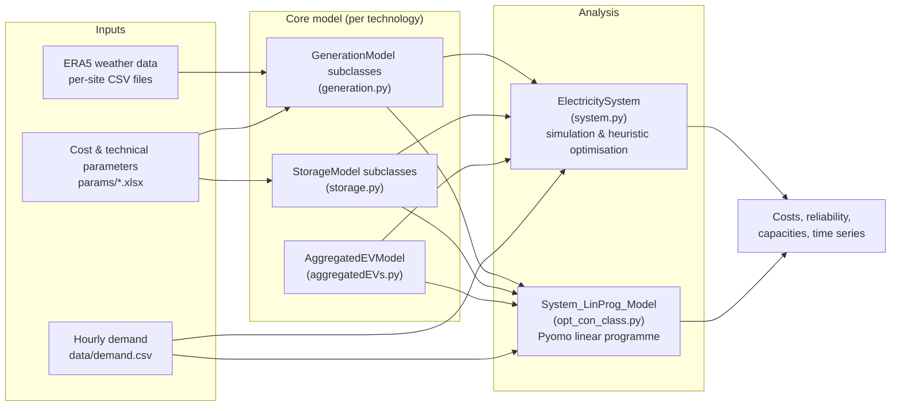

# SCORES

**SCORES** (Storage and Cost Optimisation for Renewable Energy Systems) is a
Python energy-system model for analysing how much renewable generation and
energy storage a power system needs, and what it will cost.

The model takes hourly historic weather data (ECMWF's ERA5 reanalysis;
earlier versions used NASA's MERRA-2) and hourly electricity demand, simulates the output of wind, solar, tidal and
other generators at real geographic locations, and then either:

- **simulates** how a given portfolio of generation and storage would have
  performed over the historic period, or
- **optimises** the capacities of generation and storage to meet demand at
  minimum cost, using either heuristic search or a Pyomo linear programme.

## What can SCORES answer?

- How much storage does a highly renewable Great Britain need to meet, say,
  99% of demand?
- What mix of offshore wind, onshore wind and solar minimises total system
  cost?
- What is the value of vehicle-to-grid (V2G) charging from aggregated
  electric-vehicle fleets?
- How do hydrogen storage, batteries and dispatchable low-carbon generation
  trade off against one another?

## How the documentation is organised

| Section | What it covers |
| --- | --- |
| [Getting started](getting-started/installation.md) | Installing SCORES, downloading the weather data it needs, and running a first simulation. |
| [User guide](user-guide/architecture.md) | Reference-style descriptions of each part of the model: generation, storage, whole-system simulation, optimisation, EV fleets and cost data. |
| [Tutorials](tutorials/index.md) | A progressive, hands-on course. Start at tutorial 1 and work forwards. |
| [Reference](reference/file-guide.md) | A guide to every file in the repository, and a troubleshooting page. |
| [Maintaining these docs](maintaining.md) | How to edit, build and publish this documentation (including the intranet `.aspx` export). |

## The model in one diagram

## Provenance

SCORES was created by C. Crozier (2020) and has been substantially extended
by C. Quarton, C. O'Malley, M. Tucker and others. The repository also ships
two PDF documents that predate this site &mdash; `SCORES_User_Guide.pdf` and
`Getting the Data Required to Run SCORES.pdf` (which covers the legacy
MERRA-2 data workflow; SCORES now uses ERA5) &mdash; which remain useful
background reading, and `LinearProgramFormulation.pdf`, which gives the
mathematical formulation of the linear programme in `opt_con_class.py`.
