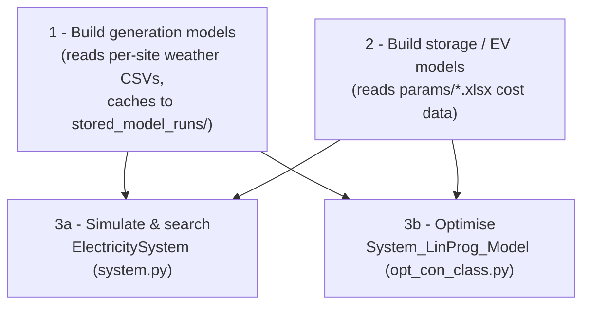

# Model architecture

SCORES is organised as a small set of core modules, each providing one
layer of the model. Analysis scripts (including everything in
`Userguide_Examples/`) are thin drivers that import these modules.

## Core modules

| Module | Provides | Key classes / functions |
| --- | --- | --- |
| `generation.py` | Technology models that turn weather data into hourly power output, with costs. | `GenerationModel` (base), `OffshoreWindModel`, `OnshoreWindModel`, `SolarModel`, `TidalStreamTurbineModel`, `NuclearModel`, `GeothermalModel`, `DispatchableGenerator`, `Interconnector` |
| `storage.py` | Storage technology models and a portfolio wrapper that simulates charging/discharging against a surplus. | `StorageModel` (base), `BatteryStorageModel`, `HydrogenStorageModel`, `ThermalStorageModel`, `MultipleStorageAssets` |
| `system.py` | Whole-system simulation and heuristic (scipy) cost optimisation. | `ElectricitySystem`, `ElectricitySystemGB`, `DispatchableOutput`, `CostOptimisation` |
| `opt_con_class.py` | Capacity sizing and operation as a Pyomo linear programme. | `System_LinProg_Model`, `opt_results_to_df`, `store_optimisation_results` |
| `aggregatedEVs.py` | Aggregated electric-vehicle fleets that behave as (constrained) storage. | `AggregatedEVModel`, `MultipleAggregatedEVs` |
| `maps.py` | Load-factor estimation and map plotting across GB. | `LoadFactorEstimator`, `LoadFactorMap` and subclasses |
| `fns.py` | Shared helpers: demand loading, filename conventions, misc plotting. | `get_GB_demand`, `get_filename`, `read_analysis_from_file` |
| `Loaderfunctions.py` | Geographic helpers for mapping real installations onto weather sites. | `latlongtosite`, `greatcircledistance` |

## Data flow

A typical study proceeds in three stages:

1. **Generation** — each `GenerationModel` subclass is constructed with a
   list of site indexes, a year range and a `data_path`. On construction it
   either loads a cached run from `stored_model_runs/` or processes the
   weather data (`run_model()`), producing `power_out`: an hourly MW time
   series for the whole simulated period, normalised to the model's
   installed capacity.

2. **Storage / EVs** — `StorageModel` subclasses hold efficiency, cost and
   rate parameters. They do nothing until asked to simulate charging
   against a *surplus* time series (generation minus demand).
   `MultipleStorageAssets` wraps several stores and dispatches them in a
   priority order. `AggregatedEVModel` describes an EV fleet whose
   connectivity varies through the day.

3. **System analysis** — two alternative engines:
     - `ElectricitySystem` (and the GB-specific `ElectricitySystemGB`)
       simulates operation hour by hour and offers heuristic optimisation
       (Latin-hypercube sampling plus `scipy.optimize.minimize`) over
       generation capacities and storage shares.
     - `System_LinProg_Model` formulates sizing and operation as a linear
       programme in Pyomo and solves it exactly with GLPK/HiGHS. It can
       co-optimise generator capacities, storage capacities, EV charger
       mixes and dispatchable generation.

## Conventions and units

These conventions hold throughout the codebase — keeping them straight
avoids most mistakes:

| Quantity | Unit | Notes |
| --- | --- | --- |
| Generator power output (`power_out`) | MW | Hourly resolution. |
| Generator capacity (model level) | MW | e.g. `scale_output(80_000)` = 80 GW. |
| Generator capacity in `ElectricitySystem.cost(x)` | **GW** | `scale_generation` multiplies by 1000. |
| Storage capacity | MWh | |
| Charge/discharge rates (`max_c_rate`) | % of capacity per hour | Defined **grid-side**. |
| Demand | MW | Positive. |
| Surplus | MW | Generation minus demand; demand alone is passed as a *negative* surplus. |
| Efficiencies | % (0–100) | |
| Costs | GBP | Capex per MW (generation) or MWh (storage medium); results in £/year or £/MWh. |
| Reliability | % of demand energy met (0–100) | |

## Caching

Generation runs are cached in `stored_model_runs/` keyed by technology,
turbine size, sites, years and months (see `fns.get_filename`). The cache
stores the *normalised* hourly output, so a cached model can be rescaled to
any capacity without re-reading weather data. Delete the folder contents to
force fresh runs, or construct models with `force_run=True`.

## Logging and outputs

Analysis methods write human-readable results into `log/` (e.g.
`ElectricitySystem.analyse()` → `log/system_analysis.txt`). Optimisation
results from the linear programme are exposed as pandas DataFrames
(`df_capacity`, `df_costs`) which you can write wherever you like.
